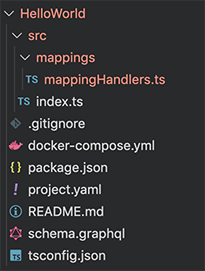
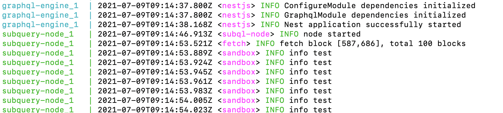

# Creating a SubQuery Project

In the [quick start](/quickstart/quickstart.md) guide, we very quickly ran through an example to give you a taste of what SubQuery is and how it works. Here we'll take a closer look at the worklow when creating your own project and the key files you'll be working with.

## The Basic Workflow

1. Initalise your project using `subql init PROJECT_NAME`
2. Update the Manifest file (`project.yaml`) to include information about your blockchain, and the entities that you will map - see [Manifest File](/create/manifest)
3. Create GraphQL entities in your schema (`schema.graphql`) that define the shape of the data that you will extract and persist for querying - see [GraphQL Schema](/create/graphql)
4. Add all the mapping functions (eg `mappingHandlers.ts`) you wish to invoke to transform chain data to the GraphQL entities that you have defined - see [Mapping](/create/mapping)
5. Generate, build, and publish your code to SubQuery Projects (or run in your own local node) - see [Running and Querying your Starter Project](/quickstart/quickstart.md#running-and-querying-your-starter-project) in our quick start guide.

## Directory Structure

The following map provides an overview of the directory structure of a SubQuery project when the `init` command is run.

```
- project-name
  L package.json
  L project.yaml
  L README.md
  L schema.graphql
  L tsconfig.json
  L docker-compose.yml
  L src
    L index.ts
    L mappings
      L mappingHandlers.ts
  L .gitignore
```

For example:



## Code Generation

Whenever you change your GraphQL entities, you must regenerate your types directory with the following command.

```
yarn codegen
```

This will create a new directory (or update the existing) `src/types` which contains generated entity classes for each type you have defined previously in `schema.graphql`. These classes provide type-safe entity loading, read and write access to entity fields - see more about this process in [the GraphQL Schema](/create/graphql).

## Build

In order run your SubQuery Project on a locally hosted SubQuery Node, you need to first build your work.

Run the build command from the project's root directory.

```shell
# Yarn
yarn build

# NPM
npm run-script build
```

## Logging

The `console.log` method is **no longer supported**. Instead a `logger` module has been injected in the types, which means we can support a logger that can accept various logging levels.

```typescript
logger.info('Info level message');
logger.debug('Debugger level message');
logger.warn('Warning level message');
```

To use `logger.info` or `logger.warn`, just place the line into your mapping file.


To use `logger.debug`, an additional step is required. Add `--log-level=debug` to your command line.

If you are running a docker container, add this line to your `docker-compose.yaml` file.


You should now see the new logging in the terminal screen.


