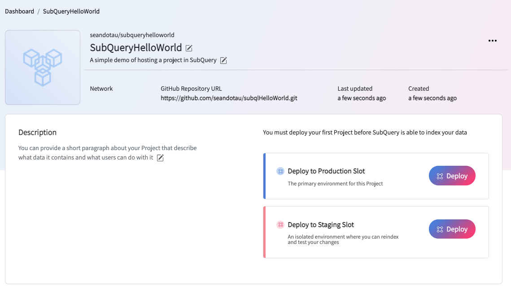
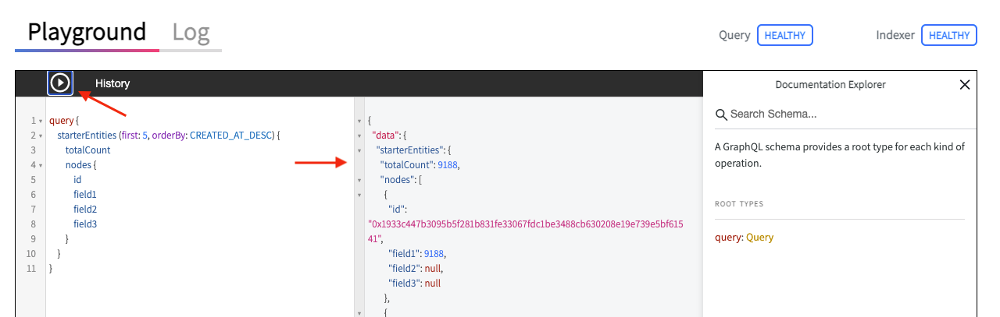
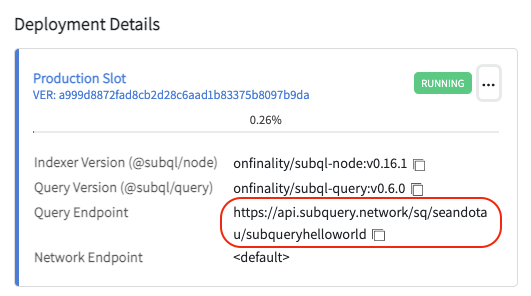

# Hello World (SubQuery hosted)

The aim of this quick start is to show how you can get the default starter project running in SubQuery Projects (our managed service) in a few easy steps.

We will take the simple starter project (and everything we've learned thus far) but instead of running it locally within Docker, we'll take advantage of SubQuery's managed hosting infrastructure. In otherwords, we let SubQuery do all the heavy lifting running and managing production infrastructure.

## Learning objectives

At the end of this quick start, you should:

- understand the required pre-requisites
- be able host a project in [SubQuery Projects](https://project.subquery.network/)
- run a simple query to get the block height of the Polkadot mainnet using the playground
- run a simple GET query to get the block height of the Polkadot mainnet using cURL

## Intended audience

This guide is geared towards new developers who have some development experience and are interested in learning more about SubQuery.

## Video guide

<figure class="video_container">
  <iframe src="https://www.youtube.com/embed/b-ba8-zPOoo" frameborder="0" allowfullscreen="true"></iframe>
</figure>

## Pre-requisites

You will need:

- a GitHub account

## Step 1: Create your project

Let's create a project called subql_hellowworld and run the obligatory install, codegen and build with your favourite package manager.

```shell
> subql init --starter subqlHelloWorld
yarn install
yarn codegen
yarn build
```

Do NOT run the docker commands though.

## Step 2: Create a GitHub repo

In GitHub, create a new public repository. Provide a name and set your visibility to public. Here, everything is kept as the default for now.


Take note of your GitHub URL, this must be public for SubQuery to access it.


## Step 3: Push to GitHub

Back in your project directory, initialise it as a git directory. Otherwise, you might get the error "fatal: not a git repository (or any of the parent directories): .git"

```shell
git init
```

Then add a remote repository with the command:

```shell
git remote add origin https://github.com/seandotau/subqlHelloWorld.git
```

This basically sets your remote repository to “https://github.com/seandotau/subqlHelloWorld.git” and gives it the name “origin” which is the standard nomenclature for a remote repository in GitHub.

Next we add the code to our repo with the following commands:

```shell
> git add .
> git commit -m "First commit"
[master (root-commit) a999d88] First commit
10 files changed, 3512 insertions(+)
create mode 100644 .gitignore
create mode 100644 README.md
create mode 100644 docker-compose.yml
create mode 100644 package.json
create mode 100644 project.yaml
create mode 100644 schema.graphql
create mode 100644 src/index.ts
create mode 100644 src/mappings/mappingHandlers.ts
create mode 100644 tsconfig.json
create mode 100644 yarn.lock
> git push origin master
Enumerating objects: 14, done.
Counting objects: 100% (14/14), done.
Delta compression using up to 12 threads
Compressing objects: 100% (13/13), done.
Writing objects: 100% (14/14), 59.35 KiB | 8.48 MiB/s, done.
Total 14 (delta 0), reused 0 (delta 0)
To https://github.com/seandotau/subqlHelloWorld.git
 * [new branch]      master -> master

```

The push command means "please push my code TO the origin repo FROM my master local repo". Refreshing GitHub should show all the code in GitHub.


Now that you have got your code into GitHub, let's look at how we can host it in SubQuery Projects.

## Step 4: Create your project

Navigate to [https://project.subquery.network](https://project.subquery.network) and log in with your GitHub account.


Then create a new project,


And fill in the various fields with the appropriate details.

- **GitHub account:** If you have more than one GitHub account, select what account this project will be created under. Projects created in an GitHub organisation account are shared between members in that organisation.
- **Project Name:** Give your project a name here.
- **Subtitle:** Provide a subtitle for your project.
- **Description:** Explain what your SubQuery project does.
- **GitHub Repository URL:** This must be a valid GitHub URL to a public repository that contains your SubQuery project. The schema.graphql file must be in the root of your directory.
- **Hide project:** If selected, this will hide the project from the public SubQuery explorer. Keep this unselected if you want to share your SubQuery with the community!


When you click create, you'll be taken to your dashboard.



The dashboard contains lots of useful information such as the network it is using, the GitHub repository URL of the source code it is running, when it was created and last updated, and in particular the deployment details.

## Step 5: Deploy your project

Now that you have created your project within SubQuery Projects, setting up the display behaviour, the next step is to deploy your project making it operational. Deploying a version triggers a new SubQuery indexing operation to start, and sets up the required query service to start accepting GraphQL requests. You can also deploy new versions to existing projects here.

You can choose to deploy to various environments such as a production slot or a staging slot. Here we'll deploy to a production slot. Clicking on the "Deploy" button brings up a screen with the following fields:


- **Commit Hash of new Version:** From GitHub select the correct commit of the SubQuery project codebase that you want deployed
- **Indexer Version:** This is the version of SubQuery's node service that you want to run this SubQuery on. See [@subql/node](https://www.npmjs.com/package/@subql/node)
- **Query Version:** This is the version of SubQuery's query service that you want to run this SubQuery on. See [@subql/query](https://www.npmjs.com/package/@subql/query)

Because we only have one commit, there is only a single option in the drop down. We'll also work with the latest version of the indexer and query version so we will accept the defaults and then click "Deploy Update".

You’ll then see your deployment in “Processing” status. Here, your code is getting deployed onto the SubQuery's managed infrastructure. Basically a server is getting spun up on demand and being provisioned for you. This will take a few minutes so time to grab a coffee!


The deployment is now running.


## Step 6: Testing your project

To test your project, click on the 3 ellipsis and select "View on SubQuery Explorer".


This will take you to the ever familiar "Playground" where you can click the play button and see the results of the query.



## Step 7: Bonus step

For the astute amongst us, you will recall that in the learning objectives, the last point was to run a simple GET query. To do this, we will need to grab the "Query Endpoint" displayed in the deployment details.



You can then send a GET request to this endpoint either using your favourite client such as [Postman](https://www.postman.com/) or [Mockoon](https://mockoon.com/) or via cURL in your terminal. For simplicity, cURL will be shown below.

The curl command to run is:

```shell
curl https://api.subquery.network/sq/seandotau/subqueryhelloworld -d "query=query { starterEntities (first: 5, orderBy: CREATED_AT_DESC) { totalCount nodes { id field1 field2 field3 } } }"
```

giving the results of:

```shell
{"data":{"starterEntities":{"totalCount":23098,"nodes":[{"id":"0x29dfe9c8e5a1d51178565c2c23f65d249b548fe75a9b6d74cebab777b961b1a6","field1":23098,"field2":null,"field3":null},{"id":"0xab7d3e0316a01cdaf9eda420cf4021dd53bb604c29c5136fef17088c8d9233fb","field1":23097,"field2":null,"field3":null},{"id":"0x534e89bbae0857f2f07b0dea8dc42a933f9eb2d95f7464bf361d766a644d17e3","field1":23096,"field2":null,"field3":null},{"id":"0xd0af03ab2000a58b40abfb96a61d312a494069de3670b509454bd06157357db6","field1":23095,"field2":null,"field3":null},{"id":"0xc9f5a92f4684eb039e11dffa4b8b22c428272b2aa09aff291169f71c1ba0b0f7","field1":23094,"field2":null,"field3":null}]}}}

```

Readability is not a concern here as you will probably have some front end code to consume and parse this JSON response.

## Summary

In this SubQuery hosted quick start we showed how quickly and easily it was to take a Subql project and deploy it to [SubQuery Projects](https://project.subquery.network) where all the infrastructure is provided for your convenience. There is an inbuilt playground for running various queries as well as an API endpoing for your code to integrate with.
