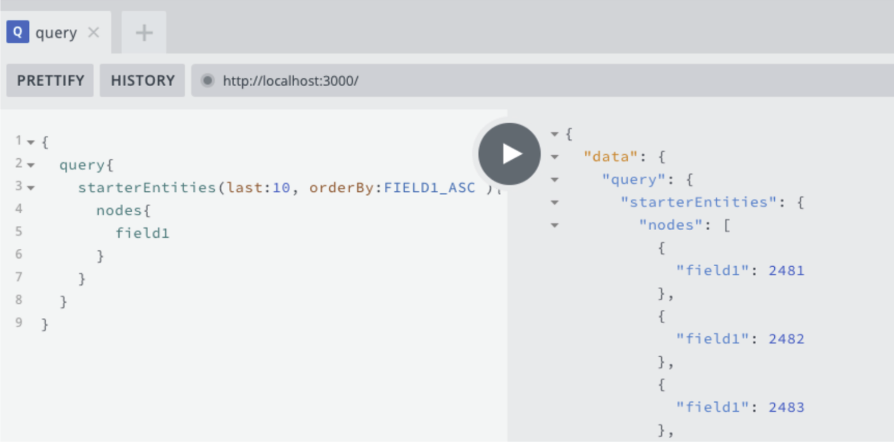

# Hello World (localhost + Docker)

Welcome to this Subql Hello World quick start. The aim of this quick start is to show you how you get the default starter project running in a docker in a few simple steps.

## Learning objectives

At the end of this quick start, you should:

- understand the required pre-requisites
- understand the basic common commands
- be able to navigate to localhost:3000 and view the playground
- run a simple query to get the block height of the Polkadot mainnet

## Intended audience

This guide is geared towards new developers who have some development experience and are interested at learning more about SubQuery.

## Video guide

<figure class="video_container">
  <iframe src="https://www.youtube.com/embed/k6iqLbzrU4g" frameborder="0" allowfullscreen="true"  width="600" height="350"> </iframe>
</figure>

## Pre-requisites

You will need:

- yarn or npm package manager
- SubQuery CLI
- Docker

You can run the following commands in a terminal to see if you already have any of these pre-requisites.

```
yarn -v (or npm -v)
subql -v
docker -v
```

For more advanced users, copy and paste the following:

```
echo -e "My yarn version is:" `yarn -v` "\nMy subql version is:" `subql -v`  "\nMy docker version is:" `docker -v`
```

This should return: (for npm users, replace yarn with npm)

```
My yarn version is: 1.22.10
My subql version is: @subql/cli/0.9.3 darwin-x64 node-v16.3.0
My docker version is: Docker version 20.10.5, build 55c4c88
```

If you get the above, then you are good to go. If not, follow these links to install them:

- [yarn](https://classic.yarnpkg.com/en/docs/install/) or [npm](https://www.npmjs.com/get-npm)
- [SubQuery CLI](http://localhost:8080/quickstart/quickstart.html#install-the-subquery-cli)
- [Docker](https://docs.docker.com/get-docker/)

## Step 1: subql init

The first step when starting off with SubQuery is to run the `subql init` command. Let's initialise a start project with the name subqlHelloWorld. Note that only author is mandatory. Everything else is left empty below.

```
> subql init --starter subqlHelloWorld
Git repository:
RPC endpoint [wss://polkadot.api.onfinality.io/public-ws]:
Authors: sa
Description:
Version: [1.0.0]:
License: [Apache-2.0]:
Init the starter package... subqlHelloWorld is ready

```

Don't forget to change into this new directory.

```shell
cd subqlHelloWorld
```

## Step 2: yarn install

Now do a yarn or node install to install the various dependencies.

```shell
# Yarn
yarn install

# NPM
npm install
```

An example of `yarn install`

```shell
> yarn install
yarn install v1.22.10
info No lockfile found.
[1/4] 🔍  Resolving packages...
[2/4] 🚚  Fetching packages...
[3/4] 🔗  Linking dependencies...
[4/4] 🔨  Building fresh packages...
success Saved lockfile.
✨  Done in 31.84s.
```

## Step 3: yarn codegen

Now run `yarn codegen` to generate Typescript from the GraphQL schema.

```shell
# Yarn
yarn codegen

# NPM
npm run-script codegen
```

An example of `yarn codegen`

```shell
> yarn codegen
yarn run v1.22.10
$ ./node_modules/.bin/subql codegen
===============================
---------Subql Codegen---------
===============================
* Schema StarterEntity generated !
* Models index generated !
* Types index generated !
✨  Done in 1.02s.
```

:warning: When changes are made to the schema file, please remember to re-run `yarn codegen` to regenerate your types directory.

## Step 4: yarn build

The next step is to build the code with `yarn build`.

```shell
# Yarn
yarn build

# NPM
npm run-script build
```

An example of `yarn build`

```shell
> yarn build
yarn run v1.22.10
$ tsc -b
✨  Done in 5.68s.
```

## Step 5: docker-compose

Using Docker allows you to run this example very quickly because all the required infrastructure can be provided within the Docker image. Run `docker-compose pull && docker-compose up`

This will kick everything into life where eventually you will get blocks being fetched.

```shell
> #SNIPPET
subquery-node_1   | 2021-06-05T22:20:31.450Z <subql-node> INFO node started
subquery-node_1   | 2021-06-05T22:20:35.134Z <fetch> INFO fetch block [1, 100]
subqlhelloworld_graphql-engine_1 exited with code 0
subquery-node_1   | 2021-06-05T22:20:38.412Z <fetch> INFO fetch block [101, 200]
graphql-engine_1  | 2021-06-05T22:20:39.353Z <nestjs> INFO Starting Nest application...
graphql-engine_1  | 2021-06-05T22:20:39.382Z <nestjs> INFO AppModule dependencies initialized
graphql-engine_1  | 2021-06-05T22:20:39.382Z <nestjs> INFO ConfigureModule dependencies initialized
graphql-engine_1  | 2021-06-05T22:20:39.383Z <nestjs> INFO GraphqlModule dependencies initialized
graphql-engine_1  | 2021-06-05T22:20:39.809Z <nestjs> INFO Nest application successfully started
subquery-node_1   | 2021-06-05T22:20:41.122Z <fetch> INFO fetch block [201, 300]
graphql-engine_1  | 2021-06-05T22:20:43.244Z <express> INFO request completed

```

## Step 6: localhost:3000

Navigate to http://localhost:3000/ and paste the query below into the left side of the screen and then hit the play button.

```
{
 query{
   starterEntities(last:10, orderBy:FIELD1_ASC ){
     nodes{
       field1
     }
   }
 }
}

```

SubQuery playground on localhost.



The block count in the playground should match the block count (technically the block height) in the terminal as well.

## Summary

In this quick start, we demonstrated the basic steps to get a starter project up and running within a Docker environment and then navigated to localhost:3000 and ran a query to return the block number of the mainnet Polkadot network.
